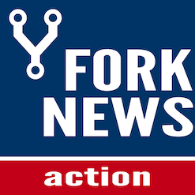

  

<h1 align="center">
  Fork News
</h1>
<h3 align="center">
  Keep your fork up to date
</h3>

  
  
  

  Fork News is a Github Action that opens a PR on your fork whenever there's a change on the upstream repository. 

## Installation
TODO

## Usage
TODO

## Contributing
Pull requests are welcome. For major changes, please open an issue first to discuss what you would like to change.

## License
[MIT](https://choosealicense.com/licenses/mit/)
